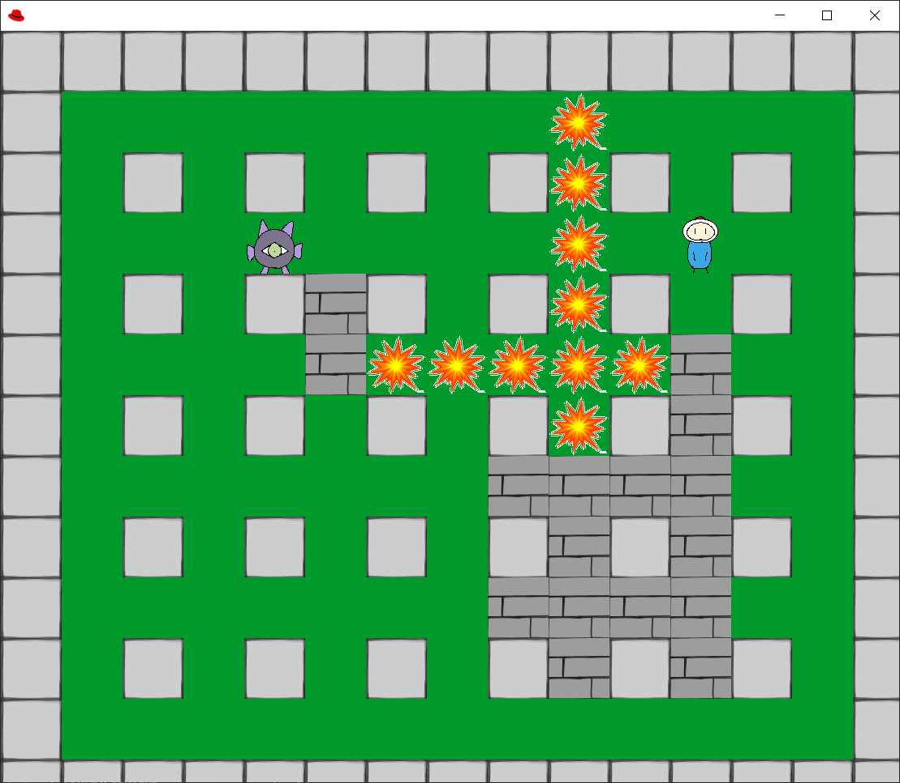
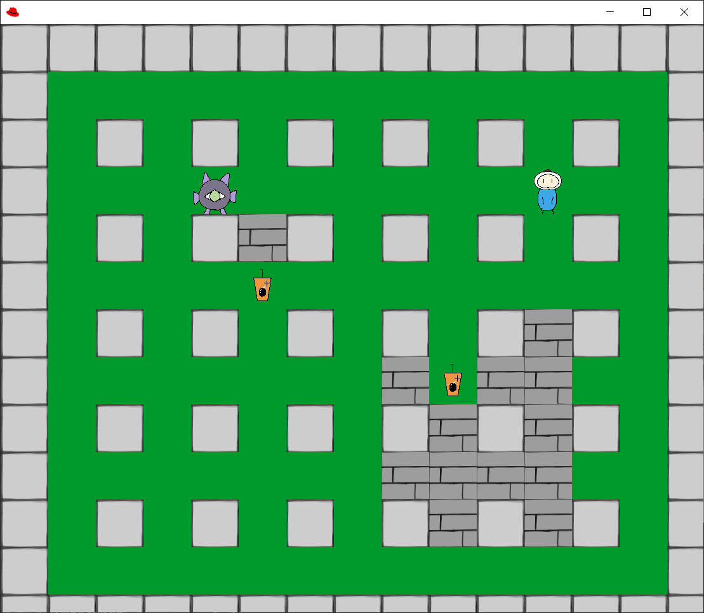

# BombMan

2人の友達と一緒にJavaで0から作った、ボンバーマンのミニゲーム。
プレイヤーがキャラクターを操作し、爆弾を置くことで障害物を壊す自身のステータスを強化するアイテムを手に入れるや、モンスターを爆弾で倒しゲームを勝つことを目的とする。

# Implementation Details
下のコマンドを実行することで、ボンバーマンのミニゲームをコンパイル・実行する。
```
javac MVC-v2.1.java
java StartGame
```


# Example
下はいくつかゲームの実行画面を示す。<br>
ゲームの最初：


爆弾を置くことで壁を壊す：


壁が壊れたら、強化アイテムの「タピオカ」が出現：

爆弾の余波でモンスターを倒せたら勝利画面：


            
            
